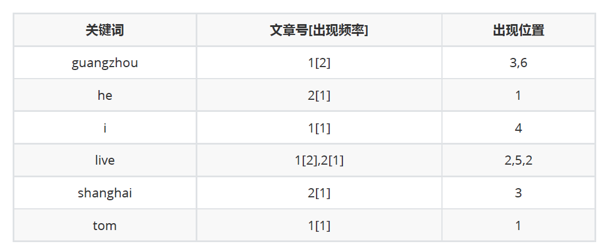

使用Lucene进行全文检索

全文检索需要先分词建立索引，然后检索内容

如何分词也很重要，取决于你使用什么分词器

大概分成下面三列情况，关键词（词典文件）、文章号（频率文件）、出现位置（位置文件）

它的关键字是按字符顺序排列的，因此 Lucene 可以用二
元搜索算法快速定位关键词。实现时 Lucene 将上面三列分别作为词典文件（Term Dictionary）、频率
文件（frequencies）和位置文件（positions）保存。其中词典文件不仅保存有每个关键词，还保留了
指向频率文件和位置文件的指针，通过指针可以找到该关键字的频率信息和位置信息。
搜索的过程是先对词典二元查找、找到该词，通过指向频率文件的指针读出所有文章号，然后返回结
果，然后就可以在具体的文章中根据出现位置找到该词了。所以 Lucene 在第一次建立索引的时候可能
会比较慢，但是以后就不需要每次都建立索引了，就快了。