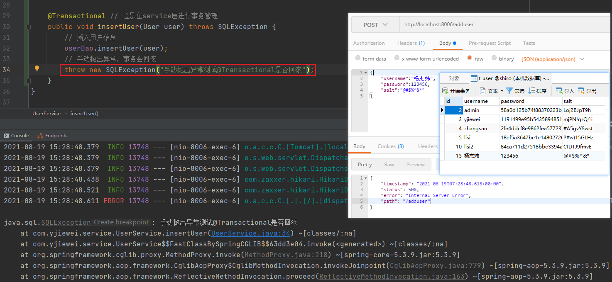

比较简单，写一下整合步骤
1. 引入依赖
```xml
<dependency>
    <groupId>org.mybatis.spring.boot</groupId>
    <artifactId>mybatis-spring-boot-starter</artifactId>
</dependency>
<dependency>
    <groupId>mysql</groupId>
    <artifactId>mysql-connector-java</artifactId>
    <scope>runtime</scope>
</dependency>
```
2. yaml配置数据源
```yaml
# 指定服务器下端口的指定数据库
datasource:
  url: localhost:3306/shiro

spring:
  datasource:
    url: jdbc:mysql://${datasource.url}?serverTimezone=GMT&useSSL=false&useUnicode=true&characterEncoding=utf-8 # 连不上的话十有八九就是这里
    driver-class-name: com.mysql.cj.jdbc.Driver
    username: root
    password: root
    hikari: # 自带的高性能数据库连接池
      maximum-pool-size: 10
      max-lifetime: 1770000

mybatis:
  # 指定别名设置的包为所有entity
  type-aliases-package: com.yjiewei.entity
  configuration:
    map-underscore-to-camel-case: true # 驼峰命名规范，比如user_name能够匹配实体的userName
  mapper-locations: # mapper映射文件位置
        - classpath:mapper/*.xml
```

3. 基于XML整合
```xml
<?xml version="1.0" encoding="UTF-8"?>
<!DOCTYPE mapper PUBLIC "-//mybatis.org//DTD Mapper 3.0//EN"
        "http://mybatis.org/dtd/mybatis-3-mapper.dtd">
<mapper namespace="com.yjiewei.dao.UserDao">

    <resultMap id="BaseResultMap" type="com.yjiewei.entity.User">
        <id column="id" jdbcType="INTEGER" property="id" />
        <result column="username" jdbcType="VARCHAR" property="username" />
        <result column="password" jdbcType="VARCHAR" property="password" />
        <result column="salt" jdbcType="VARCHAR" property="salt" />
    </resultMap>

    <!-- resultType="User" 和 resultMap="BaseResultMap" 效果一样-->
    <select id="getUserByName" resultType="User" parameterType="String">
        select * from t_user where username = #{username}
    </select>
    <!--这个文件名需要和dao的文件名一致-->
</mapper>
```

4. 启动类上扫描dao文件
   `@MapperScan("com.yjiewei.dao")`
   
5. 基于注解整合
```java
/**
 * 通过找到对应的xml文件进行sql查询，或者通过注解的方式
 * @author yjiewei
 * @date 2021/8/17
 */
@Mapper
public interface UserDao {

    User getUserByName(String username);

    @Select("select * from t_user where id = #{id}")
    @ResultMap("BaseResultMap")  // 另外一个相同用处的注解是@Results
    User getUserById(Integer id);

    @Select("select * from t_user where id = #{id} and username=#{username}")
    User getUserByIdAndName(@Param("id") Integer id, @Param("username") String username);
}
```

6. 启动测试

7. 添加事务配置管理
```text
事务是针对一个完整业务来说，要么全部完成要么失败，不存在中间状态。
配置好mybatis之后，Spring Boot 会自动注入 DataSourceTransactionManager，
我们不需要任何其他的配置就可以用 @Transactional 注解进行事务的使用。
其实不然，通常在service的方法上用这么个注解只是解决表面问题，还有很多细节需要注意。
```
- 异常没有捕获到
```text
因为 Spring Boot 默认的事务规则是遇到运行异常（RuntimeException）和程序
错误（Error）才会回滚。比如上面我们的例子中抛出的 RuntimeException 就没有问题，但是抛出
SQLException 就无法回滚了。针对非运行时异常，如果要进行事务回滚的话，可以在
@Transactional 注解中使用 rollbackFor 属性来指定异常，比如 @Transactional(rollbackFor
= Exception.class) ，这样就没有问题了，所以在实际项目中，一定要指定异常。
```


- 异常被吃掉
```text
1.通常处理异常有两种方式：上层捕获处理；异常try-catch;
2.但是try-catch就可能导致异常被吃掉，事务无法回滚
    @Transactional(rollbackFor = SQLException.class) // 这是在service层进行事务管理
    public void insertUser(User user) throws SQLException {
        try{
            // 插入用户信息
            userDao.insertUser(user);
            // 手动抛出异常，事务会回滚
            throw new SQLException("手动抛出异常测试@Transactional是否回滚");
        }catch (Exception e){
            // 我这里不处理，直接吃掉异常
        }
    }
3.建议：直接抛出去给上一层处理，千万不要吃掉异常
```

- 事务的范围(并发问题下的坑)
```java
@Service
public class UserServiceImpl implements UserService {
    
   @Resource
   private UserMapper userMapper;
   
   @Override
   @Transactional(rollbackFor = Exception.class)
   public synchronized void isertUser4(User user) {
      // 实际中的具体业务……
      userMapper.insertUser(user);
   }
}
```
```text
谨记：锁的范围要大于事务的范围。

可以看到，因为要考虑并发问题，我在业务层代码的方法上加了个 synchronized 关键字。我举个实际
的场景，比如一个数据库中，针对某个用户，只有一条记录，下一个插入动作过来，会先判断该数据库
中有没有相同的用户，如果有就不插入，就更新，没有才插入，所以理论上，数据库中永远就一条同一
用户信息，不会出现同一数据库中插入了两条相同用户的信息。
但是在压测时，就会出现上面的问题，数据库中确实有两条同一用户的信息，分析其原因，在于事务的
范围和锁的范围问题。
从上面方法中可以看到，方法上是加了事务的，那么也就是说，在执行该方法开始时，事务启动，执行
完了后，事务关闭。但是 synchronized 没有起作用，其实根本原因是因为事务的范围比锁的范围大。
也就是说，在加锁的那部分代码执行完之后，锁释放掉了，但是事务还没结束，此时另一个线程进来
了，事务没结束的话，第二个线程进来时，数据库的状态和第一个线程刚进来是一样的。即由于mysql
Innodb引擎的默认隔离级别是可重复读（在同一个事务里，SELECT的结果是事务开始时时间点的状
态），线程二事务开始的时候，线程一还没提交完成，导致读取的数据还没更新。第二个线程也做了插
入动作，导致了脏数据。
这个问题可以避免，第一，把事务去掉即可（不推荐）；第二，在调用该 service 的地方加锁，保证锁
的范围比事务的范围大即可。
```